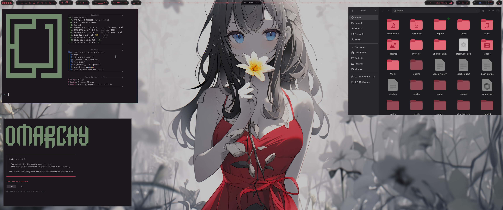

# Omarchy Primrose Theme

Primrose is a dark palette sampled directly from the *Primrose Dreams* anime wallpaper: near-black charcoal background, soft off-white foreground, a rose-red accent from the dress, icy blue from the eyes, and warm gold from the flower. Gaps and corner rounding are matched to the Oxford theme (`gaps_in = 2`, `gaps_out = 2`, `rounding = 0`).

## Preview



## Install

```bash
omarchy theme install https://github.com/Korgen-Jurai/omarchy-primrose-theme.git
```

## What's included

- Terminal palette (`colors.toml`) — drives Alacritty, Kitty, Foot, Ghostty, btop, VS Code, Obsidian, and more via Omarchy's built-in templates
- Hyprland gaps/borders/rounding (`hyprland.conf`, `hyprland.lua`)
- Icon theme pointer (`icons.theme` → Yaru-red-dark)
- Wallpaper (`backgrounds/1-primrose-dreams.jpg`)

## Wallpaper


